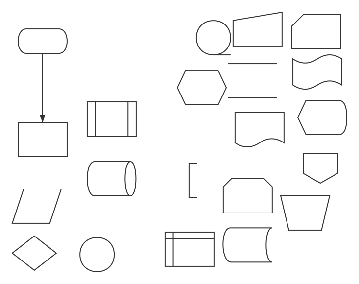
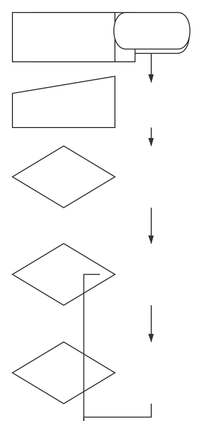

# 流程图

很多人写代码、写项目都喜欢抄起键盘就是干，这部分人中有一部分人是胸有成竹，还有一部分人是完全没搞清楚状况。
他们写了一半的代码，发现自己有些地方没有考虑清楚，又回去去改，改完了之后发现又有地方要改，最后一个简单的项目都理不清楚了。
如果他们能在写之前就画好流程图，代码模块分清楚，错误处理考虑好，就能少做很多无用功达到事半功倍的效果。

那么，什么是流程图？
流程图就是把流程用简单的图形描述出来。
流程是一系列的逻辑关系，包含了因果关系、时间关系、必要条件等等，在写代码的时候，必须先把这些逻辑关系理清楚。

为什么要画流程图？
因为人的大脑并不像计算机，很难一下子把整个逻辑的细枝末节都考虑到。
如果贸然直接去写代码，可能就会出现写这一个模块时没有考虑下一个模块的逻辑，代码冲突了。
且一个项目随着时间的发展越发庞大的时候，想对项目进行优化迭代会很困难，而有流程图的情况下，就能很快的理清楚各个代码是做什么的。
当然，对于互联网公司而言，这个是技术 leader 该做的事情，只是对于个人项目而言，就得你自己来做了。

怎么画流程图？
既然是用图形来描述逻辑，那对于图形肯定有一定的规则。

左边的可能常用一点。

现在我们有一个简单算法题，判断闰年。

描述：给定一个年份，判断这一年是不是闰年   
要求：输入一个大于 1990 小于 2050 的数，输出 yes 或 no   
样例输入：2008   
样例输出：yes   

我们先理清一下思路，不懂闰年的也可以去查一下闰年。
闰年能被 4 整除，且不能是 100 的倍数，除非它是 400 的倍数。

那么它的流程图应该就是这样的。

同样的，代码是这样的。

<pre>
#include <stdio.h>

int main() {
    int x;
    scanf("%d", &x);
    if ((x % 4 == 0 && x %100 != 0) || x % 400 == 0){
        printf("yes");
    } else {
        printf("no");
    }
	return 0;
}
</pre>

和流程图有所不同。这是因为教你们的流程图都尽可能的简单，而代码那么写无法忍受。

